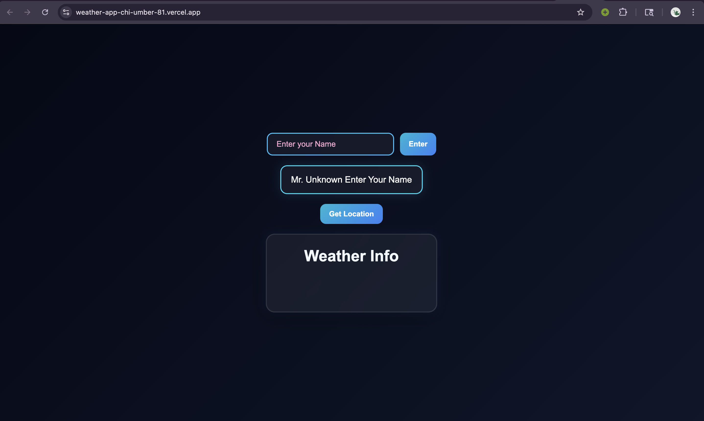

# Weather By User Location
A simple responsive weather app that uses the browser Geolocation API to fetch real-time weather data based on the user's current location.

# Features
- Real-time weather updates
- Location-based weather detection
- Responsive UI
- Local storage for username
- Secure backend with environment variables

# Tech Stack
- HTML
- CSS
- JavaScript
- Node.js
- Express.js

# Screenshot

# Author
Penuel Daimari